<!-- .slide: data-background="images/partistat.png" class="background smallquote" style="color: white" -->

<h2>Real time machine learning</h2>
<h4>Streaming data pipelines with kafka and spark</h4>

   
   
    Alejandro Saucedo   
    <a href="http://twitter.com/AxSaucedo">@AxSaucedo</a> 
    <a href="http://linkedin.com/in/AxSaucedo">in/axsaucedo</a> 
   

[NEXT]
<!-- .slide: data-background="images/partistat.png" class="background smallquote" style="color: white" -->

<h2>Real time machine learning</h2>
<h4>Streaming data pipelines with kafka and spark</h4>

<table class="bio-table">
  <tr>
    <td style="float: left">
         
        
         
        Alejandro Saucedo
         
         
    </td>
    <td style="float: left; color: white; font-size: 0.7em;">

         
        Chief Scientist
         
        <a style="color: cyan" href="http://e-x.io">The Institute for Ethical AI & ML</a
         
         
         
        

         
        Head of Solutions Eng. & Sci.
         
        <a style="color: cyan" href="http://eigentech.com">Eigen Technologies</a>
         
         
        Chief Technology Officer
         
        <a style="color: cyan" href="#">Hack Partners</a>
         
         
        Software Engineer
         
        <a style="color: cyan" href="#">Bloomberg LP.</a>

    </td>
  </tr>
  <tr>
  </tr>
</table>

[NEXT]
<!-- .slide: data-background="images/partistat.png" class="background smallquote" style="color: white" -->

## Today: Real Time ML

> Conceptual intro to ETL, Streaming
>  
>  
> Machine learning fundamentals in context
>
> Tradeoffs and current developments
>
> Hands on demo developing ETL on streams

### The big picture, then deep dive

[NEXT]
<!-- .slide: data-background="images/partistat.png" class="background smallquote" style="color: white" -->

#### Today we are...

# Learning by example

[NEXT]
<!-- .slide: data-background="images/partistat.png" class="background smallquote" style="color: white" -->

# Reddit comments

> Tackling hate in the internet comments
>  
>  
> Heavy compute data analysis, Transform, Fetch... 
>
> Using Big Data & ML frameworks
>
> Real time requirements for alerts
>

 
#### Can we survive  another social media chaos?

[NEXT]
<!-- .slide: data-background="images/partistat.png" class="background smallquote" style="color: white" -->

# The Dataset

> 50,000 removed comments from /r/science
>
> 200,000 high level comments across same subreddit

> Comments have upvotes, time posted, parent ID...

> Real time stream of reddit comments

[NEXT]
<!-- .slide: data-background="images/partistat.png" class="background smallquote" style="color: white" -->
### Code (TBP) 
https://github.com/axsauze/kafka-spark-real-time-ml

### Slides
http://github.com/axsauze/kafka-spark-real-time-ml-slides

[NEXT]
<!-- .slide: data-background="images/partistat.png" class="background smallquote" style="color: white" -->

## #LetsDoThis

[NEXT SECTION]
<!-- .slide: data-background="images/polygon-dark.jpg" class="background" style="color: white" -->
# 1) Batch ETL

[NEXT]
<!-- .slide: data-background="images/polygon-dark.jpg" class="background" style="color: white" -->

# 1.1 What is ETL?

 
#### Or, how to avoid crontab hell?

[NEXT]
<!-- .slide: data-background="images/polygon-dark.jpg" class="background" style="color: white" -->
## ETL Breakdown

<video src="images/automation.mp4" data-autoplay="" loop="" playsinline="" style="margin: 10px 0 10px 0"></video>

#### E - Extract
#### T - Transform
#### L - Load

[NEXT]
<!-- .slide: data-background="images/polygon-dark.jpg" class="background" style="color: white" -->

# Variations

### ETL - Extract Tranform Load
### ELT - Extract Load Transform
### EL - Extract Load
### LT - Load Transform
### WTF - LOL

[NEXT]
<!-- .slide: data-background="images/polygon-dark.jpg" class="background" style="color: white" -->

# Specialised tools

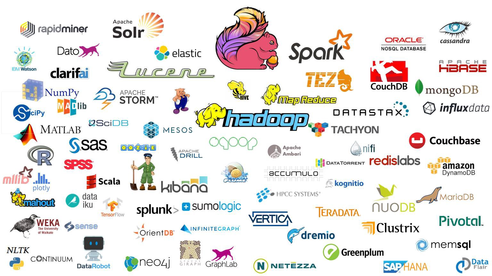

[NEXT]
<!-- .slide: data-background="images/polygon-dark.jpg" class="background" style="color: white" -->

	<h2>ETL</h2>
	<ul>
	<li>Oozie</li>
	<li>Airflow (+engine)</li>
	</ul>

	<h2>EL</h2>
	<ul>
	<li>Nifi</li>
	<li>Flume</li>
	</ul>

	<h2>ELT</h2>
	<ul>
	<li>Elastic stack</li>
	<li>Data Warehouse</li>
	</ul>

[NEXT]
<!-- .slide: data-background="images/polygon-dark.jpg" class="background" style="color: white" -->

### Spark Batch Analysis

<pre><code class="code python hljs" style="font-size: 0.8em; line-height: 1em">

from pyspark.sql.types import IntegerType
from pyspark.sql.functions import udf, col

df = (spark.read.format("com.databricks.spark.csv")
        .option("quoteMode","ALL")
        .option("multiLine","true")
        .option("wholeFile","true")
        .option("header", "true")
        .option("inferSchema","true")
        .load("/machinelearning/reddit_200k.csv"))

df_input.select("body", "removed", "score").show()

</code></pre>

<pre><code class="code bash hljs" style="font-size: 0.8em; line-height: 1em">
> +--------------------+-------+-----+ 
> | body               |removed|score| 
> +--------------------+-------+-----+ 
> |I have always bee...| False | 2   | 
> |As an ECE, my fin...| True  | 2   |
> +--------------------+-------+-----+ 

</code></pre>

[NEXT SECTION]
<!-- .slide: data-background="images/black-blue-waves.jpg" class="background" -->
# 2) Streaming

[NEXT]
<!-- .slide: data-background="images/black-blue-waves.jpg" class="background" -->

# Batch vs Stream

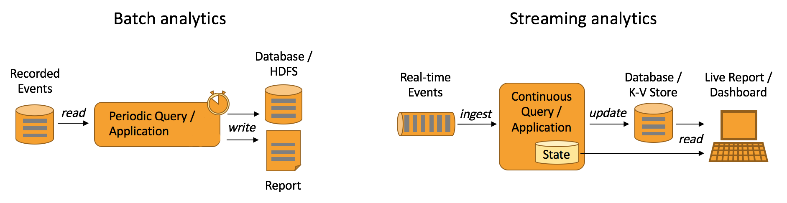

#### Still on the ETL world, but with different foundational requirements

[NEXT]
<!-- .slide: data-background="images/black-blue-waves.jpg" class="background" -->

# Batch AND Stream

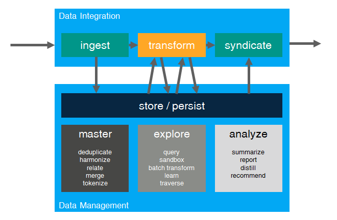

[NEXT]
<!-- .slide: data-background="images/black-blue-waves.jpg" class="background" -->

# Unifying worlds

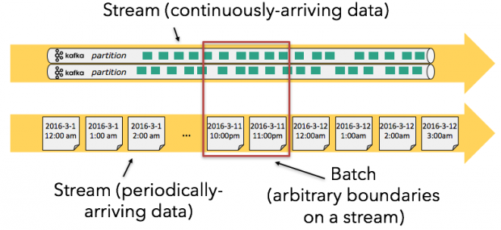

#### The massive push to converge the APIs for streams and batch processing (i.e. Spark, Flink, BEAM, etc)

[NEXT]
<!-- .slide: data-background="images/black-blue-waves.jpg" class="background" -->

# Stream Processing Concepts

[NEXT]
<!-- .slide: data-background="images/black-blue-waves.jpg" class="background" -->

# Windows

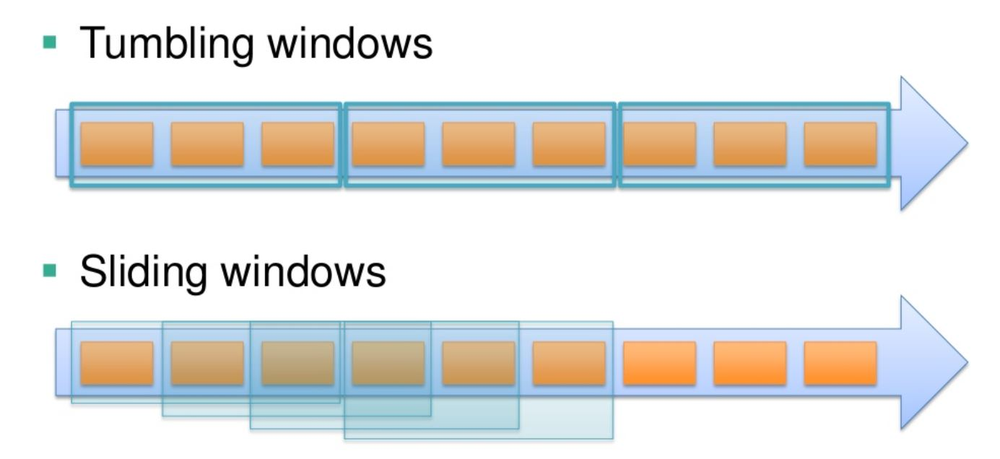

[NEXT]
<!-- .slide: data-background="images/black-blue-waves.jpg" class="background" -->

# Checkpointing
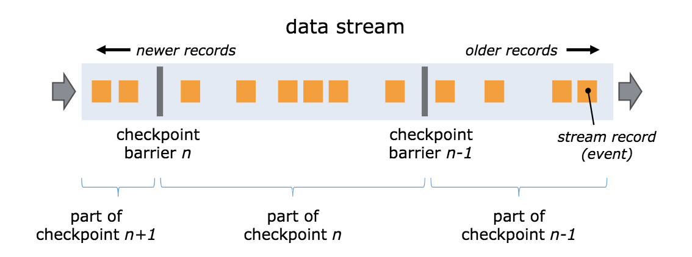

[NEXT]
<!-- .slide: data-background="images/black-blue-waves.jpg" class="background" -->

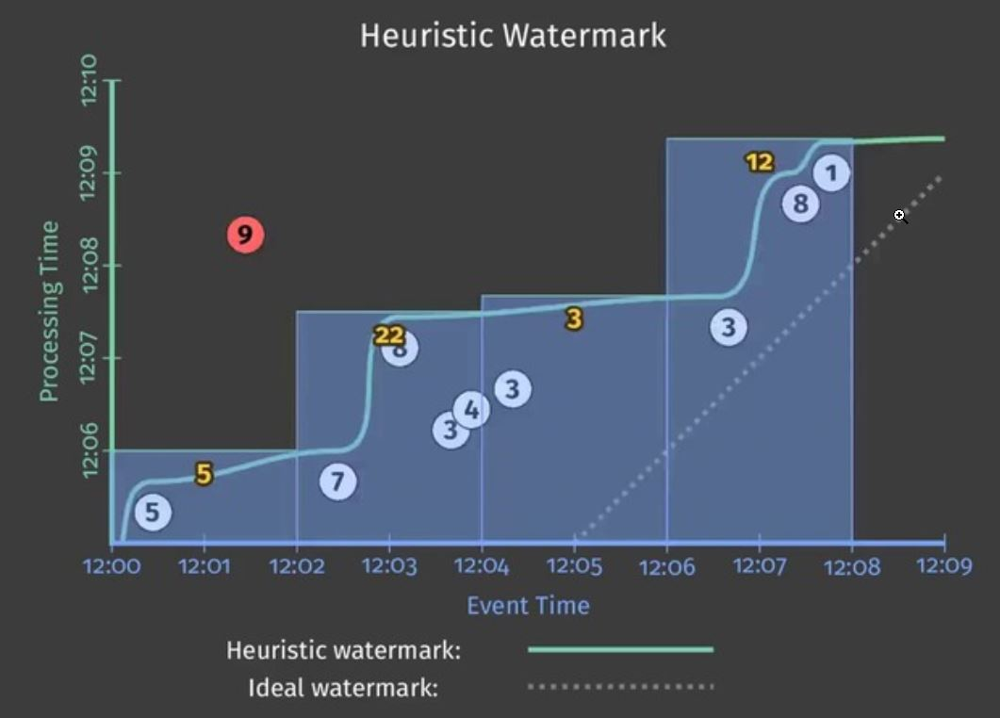

[NEXT]
<!-- .slide: data-background="images/black-blue-waves.jpg" class="background" style="color: white"-->

## Thoughts on popular tools

* Flink
* Kafka Streams
* Faust (Python)
* Apache Beam

[NEXT]
<!-- .slide: data-background="images/black-blue-waves.jpg" class="background" style="color: white"-->

## Spark Streaming

<pre><code class="code python hljs" style="font-size: 1em; line-height: 1em">
ssc = StreamingContext(sc, batchDuration=2)

# ...

stream = KafkaUtils.createDirectStream(
    ssc, 
    [REDDIT_TOPIC], 
    {"metadata.broker.list": KAFKA_BROKERS})

</code></pre>

[NEXT SECTION]
<!-- .slide: data-background="images/network-background.jpg" class="background" -->
# 3) Machine Learning

[NEXT]
<!-- .slide: data-background="images/network-background.jpg" class="background" -->

# And ML?

#### ML benefits from the data pipeline ecosystem

[NEXT]
<!-- .slide: data-background="images/network-background.jpg" class="background" -->

# But ML is Different...

#### Let's look at the standard ML workflow

[NEXT]
<!-- .slide: data-background="images/network-background.jpg" class="background" -->

### Step 1: Add layers until it works

## Step 2: repeat

[NEXT]
<!-- .slide: data-background="images/network-background.jpg" class="background" -->
## Two stages:

**Model development** and then **model deployment**

[NEXT]
<!-- .slide: data-background="images/network-background.jpg" class="background" -->

#### ETL job behaves differently depending on state

#### Added complexities such as reproducibility, monitoring, etc

[NEXT]
<!-- .slide: data-background="images/network-background.jpg" class="background" -->
## Abstraction on steps

<h4>Data in </h4>

<pre><code class="code python hljs" style="font-size: 0.6em; line-height: 1em">
$ cat data-input.csv

>            Date    Open    High     Low   Close     Market Cap
> 1608 2013-04-28  135.30  135.98  132.10  134.21  1,500,520,000
> 1607 2013-04-29  134.44  147.49  134.00  144.54  1,491,160,000
> 1606 2013-04-30  144.00  146.93  134.05  139.00  1,597,780,000

</code></pre>

<h4>Code / Config</h4>
<pre><code class="code python hljs" style="font-size: 0.6em; line-height: 1em">
$ cat feature-extractor.py

> def open_norm_feature_extractor(df):
>     feature = some_lib.get_open(df)
>     return feature

</code></pre>

<h4>Data out</h4>
<pre><code class="code python hljs" style="font-size: 0.6em; line-height: 1em">
$ cat data-output.csv

>   Open 
>   0.57 
>   0.59 
>   0.47 

</code></pre>

[NEXT]
<!-- .slide: data-background="images/network-background.jpg" class="background" -->

## Abstraction on infrastructure

[NEXT]
<!-- .slide: data-background="images/network-background.jpg" class="background smallest" -->

## Check out the entire list

||||
|-|-|-|
|[Explainability](https://github.com/EthicalML/awesome-machine-learning-operations#1-explaining-black-box-models-and-datasets) |[Privacy](https://github.com/EthicalML/awesome-machine-learning-operations#2-privacy-preserving-machine-learning) | [Versioning](https://github.com/EthicalML/awesome-machine-learning-operations#3-model-and-data-versioning)|
|[Orchestration](https://github.com/EthicalML/awesome-machine-learning-operations#4-model-deployment-and-orchestration-frameworks)|[FeaturEng](https://github.com/EthicalML/awesome-machine-learning-operations#5-feature-engineering-automation)|[AutoML](https://github.com/EthicalML/awesome-machine-learning-operations#6-neural-architecture-search)|
| [Notebooks](https://github.com/EthicalML/awesome-machine-learning-operations#7-data-science-notebook-frameworks) | [Visualisation](https://github.com/EthicalML/awesome-machine-learning-operations#8-industrial-strength-visualisation-libraries) | [NLP](https://github.com/EthicalML/awesome-machine-learning-operations#9-industrial-strength-nlp) |
| [ETL](https://github.com/EthicalML/awesome-machine-learning-operations#10-data-pipeline-etl-frameworks) | [Storage](https://github.com/EthicalML/awesome-machine-learning-operations#11-data-storage-optimisation) | [FaaS](https://github.com/EthicalML/awesome-machine-learning-operations#12-function-as-a-service-frameworks) |
| [Computation](https://github.com/EthicalML/awesome-machine-learning-operations#13-computation-load-distribution-frameworks) | [Serialisation](https://github.com/EthicalML/awesome-machine-learning-operations#14-model-serialisation-formats) | [Compiler](https://github.com/EthicalML/awesome-machine-learning-operations#15-compiler-optimisation-frameworks)  |
| [CommercialML](https://github.com/EthicalML/awesome-machine-learning-operations#16-commercial-data-science-platforms) | [CommercialETL](https://github.com/EthicalML/awesome-machine-learning-operations#17-commercial-etl-platforms)| |
 
### bit.ly/awesome-mlops

[NEXT]
<!-- .slide: data-background="images/black-blue-waves.jpg" class="background" style="color: white"-->

## Spark ML (+ SpaCy) 

<pre><code class="code python hljs" style="font-size: 1em; line-height: 1em">
pipeline = Pipeline(
    stages=[
        SpacyTokenizer(
            inputCol="body", outputCol="body_tokenized"), 
        NGram(
            inputCol='body_tokenized', outputCol='body_ngram', n=3), 
        CountVectorizer(
            inputCol='body_ngram', outputCol='body_tf'), 
        IDF(
            inputCol='body_tf', outputCol='body_tfidf'),
        LogisticRegression(
            featuresCol='body_tfidf', ...)])
    
</code></pre>

[NEXT SECTION]
<!-- .slide: data-background="images/partistat.png" class="background smallquote" style="color: white"  data-transition="slide-in fade-out" -->
# 4) Putting it all together

[NEXT]
<!-- .slide: data-background="images/partistat.png" class="background smallquote" style="color: white"  data-transition="fade-in fade-out" -->

## Overview of components

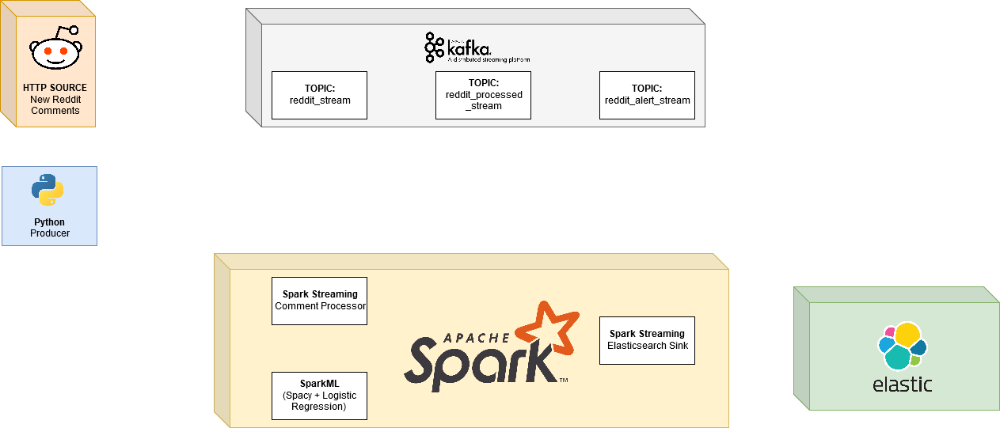

[NEXT]
<!-- .slide: data-background="images/partistat.png" class="background smallquote" style="color: white"  data-transition="fade-in fade-out" -->

### Creating a stream of reddit comments

[NEXT]
<!-- .slide: data-background="images/partistat.png" class="background smallquote" style="color: white"  data-transition="fade-in fade-out" -->

### Stram processor subscribing to topic

[NEXT]
<!-- .slide: data-background="images/partistat.png" class="background smallquote" style="color: white"  data-transition="fade-in fade-out" -->

### Processing ML prediction 

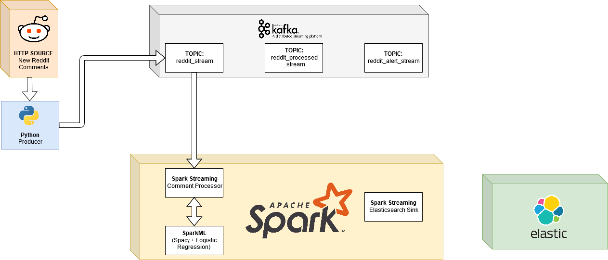

[NEXT]
<!-- .slide: data-background="images/partistat.png" class="background smallquote" style="color: white"  data-transition="fade-in fade-out" -->

### Pushing results of classification

[NEXT]
<!-- .slide: data-background="images/partistat.png" class="background smallquote" style="color: white" data-transition="fade-in fade-out"  -->

### Push flagged results to alert

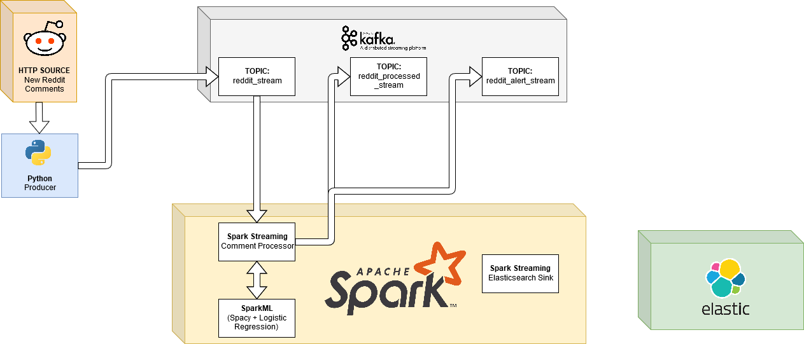

[NEXT]
<!-- .slide: data-background="images/partistat.png" class="background smallquote" style="color: white"  data-transition="fade-in slide-out" -->

### Use elastic sink to push to elastic

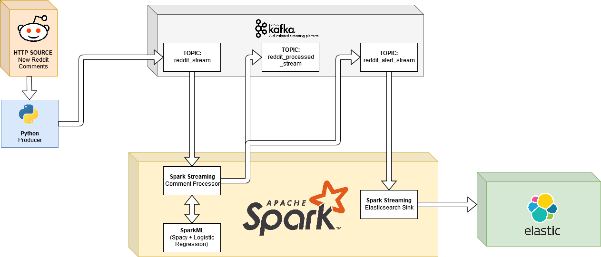

[NEXT]
<!-- .slide: data-background="images/partistat.png" class="background smallquote" style="color: white" -->

# Are we done?

Almost, we still need to know where the model came from!

[NEXT]
<!-- .slide: data-background="images/partistat.png" class="background smallquote" style="color: white" -->

### We build a model through Zeppelin interface using spark + reddit data

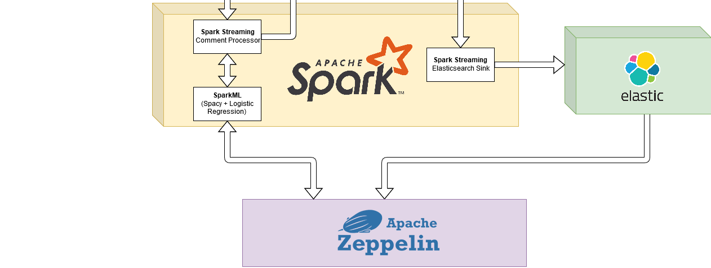

[NEXT]
<!-- .slide: data-background="images/partistat.png" class="background smallquote" style="color: white" -->

### Let's dive into the code!

[NEXT SECTION]
<!-- .slide: data-background="images/network-background.jpg" class="background smallest" -->

## Today: Real Time ML

> Conceptual intro to ETL, Streaming
>  
>  
> Machine learning fundamentals in context
>
> Tradeoffs and current developments
>
> Hands on demo developing ETL on streams

### The big picture, then deep dive

[NEXT]
<!-- .slide: data-background="images/partistat.png" class="background smallquote" style="color: white" -->
### Code (TBP) 
https://github.com/axsauze/kafka-spark-real-time-ml

### Slides
http://github.com/axsauze/kafka-spark-real-time-ml-slides

[NEXT]
<!-- .slide: data-background="images/network-background.jpg" class="background" -->

<h2>Real time machine learning</h2>
<h4>Streaming data pipelines with kafka and spark</h4>

<table class="bio-table">
  <tr>
    <td style="float: left">
        
         
        Alejandro Saucedo
         
         
    </td>
    <td style="float: left; color: white; font-size: 0.7em;">

         
        Chief Scientist
         
        <a style="color: cyan" href="http://e-x.io">The Institute for Ethical AI & ML</a>
         
         
        Fellow (AI, Data & ML)
         
        <a style="color: cyan" href="#">The RSA</a>
         
         
        Advisor
         
        <a style="color: cyan" href="http://teensinai.com">TeensInAI.com initiative</a>
         

    </td>
  </tr>
  <tr>
  </tr>
</table>

